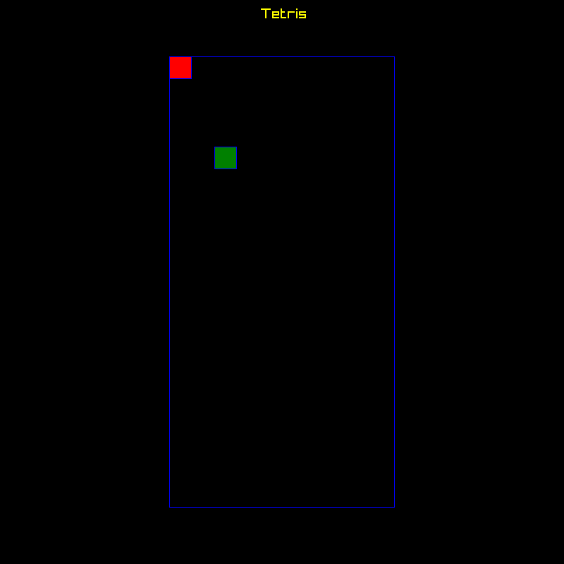
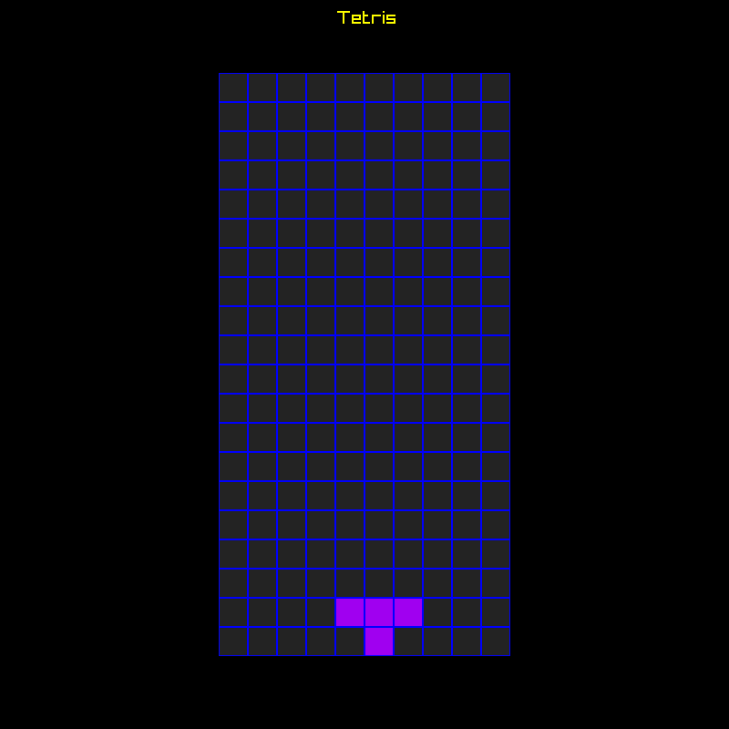

## Passo 1: Validar Ambiente

Para usar rust, cargo e raylib, vou assumir que você está no Linux. Assim sendo, instale o seguinte:

```bash
sudo apt update
sudo apt install -y \
build-essential \
pkg-config \
cmake \
git \
curl \
clang \
libclang-dev \
libasound2-dev \
libx11-dev \
libxrandr-dev \
libxi-dev \
libgl1-mesa-dev \
libglu1-mesa-dev \
libxcursor-dev \
libxkbcommon-dev \
wayland-protocols \
libglfw3-dev
```

Essas libs e ferramentas servem para o seguinte:

- build-essential: GCC, linker e make.
- cmake: raylib-sys usa CMake para compilar a raylib.
- clang e libclang-dev? necessário para o bindgen.
- libasound2-dev: áudio via ALSA.
- libx11-dev, libxrandr-dev, libxi-dev, libxcursor-dev, libxinerama-dev: para janela, input no X11/XWayland.
- libgl1-mesa-dev, libfglu1-mesa-dev: para OpenGL/Mesa.
- libwayland-dev, libxkbcommon-dev, wayland-protocols: para ambientes wayland.
- libglfw3-dev: raylib-rs tem GLFW como dependência de build.

Para instalar Rust faça:

```bash
curl --proto '=https' --tlsv1.2 -sSf https://sh.rustup.rs | sh
source "$HOME/.cargo/env"
```

O comando *curl* vai baixar o script de instalação do *rustup* e enviar para *sh*, cujo qual vai executar o instalador em seguida. 

As flags -sSf significam, na ordem: modo silencioso, mostrar mensagens de erro e falhar caso a resposta HTTP seja 4xx ou 5xx, evitando baixar e enviar uma página do erro HTML para o *sh*.

A opção `--proto '=https' --tlsv1.2` é pra garantir que vai aceitar apenas TLS.

O segundo comando, source "$HOME/.cargo/env", atualiza o ambiente do terminal atual tornando disponível os comandos *rustc* e *cargo*.

> o comando curl | sh vai executar na sua máquina o script baixado, nunca rode esse comando se não confiar na fonte.

Se os comandos:

```bash
cmake --version
rustc --version
cargo --version
```

funcionarem, podemos prosseguir. A saída será algo como:

```bash
cmake version 3.31.10
rustc 1.96.0 (ac68faa20 2026-05-25)
cargo 1.96.0 (30a34c682 2026-05-25)
```


## Passo 2: Criar o Projeto

Agora use o comando cargo new para criar um projeto Rust: 

```bash
cargo new rust-tetris-tutorial
code rust-tetris-tutorial
```

Isso vai criar o projeto e abrir no vscode. No terminal do vscode rode:

```bash
cargo run
```
Você deverá ver "Hello, world!" confirmando que tudo está ok.


## Passo 3: Instalando e usando Raylib

## Instalação da raylib-rs

Para esse tutorial vamos fixar a versão 6.0.0 da raylib-rs.

No arquivo `Cargo.toml` inclua a dependência abaixo da seção `[dependencies]`:

```toml
[dependencies]
raylib = "=6.0.0"
```

Você pode também adicionar pelo terminal com o comando:

```bash
cargo add raylib@6.0
```

Esse comando altera o `Cargo.toml` automaticamente e resolve a dependência.

## Criando a primeira janela

Substitua o conteúdo do arquivo `src/main.rs` por:

```rust
use raylib::prelude::*;

fn main() {
    let (mut rl, thread) = raylib::init()
        .size(800, 600)
        .title("Hello Raylib")
        .build();

    while !rl.window_should_close() {

        rl.draw(&thread, |mut d| {
            d.clear_background(Color::BLACK);
            d.draw_text("Hello, world!", 190, 200, 20, Color::YELLOW);
        });
    }
}
```

Execute com o comando:

```bash
cargo run
```

Se tudo deu certo você deverá ver uma janela com fundo preto e escrito em amarelo `Hello, world!` na posição (190, 200). A raylib coloca a posição (0,0) no canto superior esquerdo.

## Entendendo o Código


Em C, a raylib é bem direta, o código que fizemos seria algo como:

```c
int main(void)
{
    InitWindow(800, 600, "Tetris");

    while (!WindowShouldClose())
    {
        BeginDrawing();
        ClearBackground(WHITE);
        DrawText("Hello, world!", 190, 200, 20, BLACK);
        EndDrawing();
    }

    CloseWindow();
    return 0;
}

```

A versão C original usa funções globais como `InitWindow`, `BeginDrawing`, `EndDrawing` e `CloseWindow`. O estado interno é mantido pela raylib: janela, contexto, framebuffer, input, tempo, resources, etc... Chamamos as funções na ordem correta e o resto a raylib gerencia.

Em Rust, usando raylib-rs, a API encapsula em tipos. No trecho de código:

```rust
    let (mut rl, thread) = raylib::init()
        .size(800, 600)
        .title("Hello Raylib")
        .build();

```
O método build é chamado a partir de `RaylibBuilder`, que é retornado pela função `init`, e retorna uma tupla com os objetos: `RaylibHandle` e `RaylibThread`. Então desestruturamos o retorno para as variáveis `rl` e `thread`. 

Em `rl` temos o handle principal da *raylib-rs*, ele representa a janela, o contexto gráfico e a interface pricipal. Por meio desse handle consultamos se a janela precisa ser fechada, pegamos a entreda, configuramos FPS, carregamos texturas e iniciamos o desenho. Por exemplo:

```rust
rl.window_should_close();
rl.set_target_fps(60);
rl.is_key_down(KeyboardKey::KEY_RIGHT);
rl.load_texture(&thread, "assets/player.png");
```

Já em `thread` temos um token para indicar que as operações estão sendo feitas na thread correta. Esse tipo não existe na API C original da raylib; ele é uma abstração criada pelo binding Rust. Sua definição é como segue:

```rust
pub struct RaylibThread(PhantomData<*const ()>);
```

O tipo usado como marcador é: `*const ()`.

`*const T` é um ponteiro raw constante para algum tipo `T`. O tipo `()` é o tipo unitário de Rust, usado para representar "nenhum valor útil". Então `*const ()` pode ser lido como "ponteiro raw para nada em particular".

Tanto `RaylibThread` quanto `PhantomData` não estão ali para armazenar dados relevantes em runtime. Eles apenas influenciam como o compilador trata esse tipo.

Isso aparece bastante em Rust quando uma biblioteca quer representar uma regra em tempo de compilação. No caso da `raylib-rs`, o `RaylibThread` funciona como um token onde algumas operações só são aceitas se você apresentar esse valor.

Dessa forma, sempre que passamos `thread` para uma função, estamos entregando à API uma prova de que aquela operação está sendo feita no contexto correto da Raylib.


Logo em seguida criamos um laço que só se encerra quando a janela receber uma solicitação para encerrar, via ESC ou ao clicar no botão fechar. O método usado é:

```rust
rl.window_should_close()
```

Dentro do laço, usamos o método `draw` para desenhar um frame:

```rust
rl.draw(&thread, |mut d| {
    d.clear_background(Color::BLACK);
    d.draw_text("Hello, world!", 190, 200, 20, Color::YELLOW);
});
```

O trecho:

```rust
|mut d| {
    // ...
}   
```
é uma closure em Rust. Para simplificar, podemos pensar nela como uma função que estamos passando para o método `draw`.

O método `draw` inicia o desenho do frame, cria um handle temporário de desenho e entrega esse handle para a closure. No nosso código, chamamos esse handle de `d`:

```rust
|mut d| {
    d.clear_background(Color::BLACK);
    d.draw_text("Hello, world!", 190, 200, 20, Color::YELLOW);
}
```

Quando chamamos métodos como `clear_background` e `draw_text`, estamos emitindo comandos de desenho para o frame atual.

Diferente da versão em C, na versão Rust a `raylib-rs` encapsula o ciclo dentro de rl.draw. Por isso não chamamos `BeginDrawing` e `EndDrawing` manualmente.

## Passo 4: O primeiro bloco e a grade

Normalmente em jogos como Tetris e Snake dividimos o 'mundo' em blocos de tamanho fixo conhecidos como tiles. Isso nos permite transformar o mapa do jogo em uma grade x por y com x tiles de largura e y tiles de altura.

Para desenhar um retângulo é muito simples, basta chamar a função `draw_rectangle` passando a posição, o tamanho e a cor. Primeiro vamos preparar algumas constantes.

Coloque o seguinte no início de `src/main.rs`:

```rust
const TILE_SIZE: i32 = 32;
const BOARD_WIDTH: i32 = 10 * TILE_SIZE;
const BOARD_HEIGHT: i32 = 20 * TILE_SIZE;
const BOARD_OFFSET_X: i32 = (SCREEN_WIDTH - BOARD_WIDTH) / 2;
const BOARD_OFFSET_Y: i32 = (SCREEN_HEIGHT - BOARD_HEIGHT) / 2;
const SCREEN_WIDTH: i32 = 800;
const SCREEN_HEIGHT: i32 = 800;
```

Com essas definições podemos desenhar um board centralizado na janela da seguinte forma:

```rust
fn draw_block(d: &mut RaylibDrawHandle, x: i32, y: i32, color: Color) {
    let px = BOARD_OFFSET_X + x * TILE_SIZE;
    let py = BOARD_OFFSET_Y + y * TILE_SIZE;

    d.draw_rectangle(px, py, TILE_SIZE, TILE_SIZE, color);
    d.draw_rectangle_lines(px, py, TILE_SIZE, TILE_SIZE, Color::BLUE);
}

fn draw_board(d: &mut RaylibDrawHandle) {
    d.draw_rectangle_lines(BOARD_OFFSET_X, BOARD_OFFSET_Y, BOARD_WIDTH, BOARD_HEIGHT, Color::BLUE);
    
    draw_block(d, 0, 0, Color::RED);
    draw_block(d, 2, 4, Color::GREEN);
}
```
E a closure `draw` chama draw_board:

```rust
 rl.draw(&thread, |mut d| {
            d.clear_background(Color::BLACK);
            d.draw_text("Tetris", SCREEN_WIDTH / 2 - 30, 10, 20, Color::YELLOW);

            draw_board(&mut d);
        });
```

Você deverá ver uma janela como a print a seguir:



Apesar de simples, esse código permite trabalhar toda a parte visual do jogo. O resto agora é muito mais lógica e código Rust do que raylib.

## Passo 5: Modelagem do Jogo

Um jogo normalmente possui um estado, operações dinâmicas que alteram o estado e então o desenho na tela do estado naquele frame. Para o Tetris temos peças e o board. O Board, tem células e as peças tem tipos. Peça, Board, Tipo de Peça e Célula podem ser modeladas conforme as seções a seguir.

### Tipo de Peça

No tetris clássico são 7 tipos: I, O, T, S, Z, J e L. Podemos armazenar esses tipos em um enum.

```rust
#[derive(Clone, Copy)]
enum TetrominoKind {
    I, O, T, S, Z, J, L,
}
```

Podemos também ter uma função associada que devolve a cor do tipo.

```rust
impl TetrominoKind {
    fn color(self) -> Color {
        match self {
            TetrominoKind::I => Color::new(0, 240, 240, 255),
            TetrominoKind::O => Color::new(240, 240, 0, 255),
            TetrominoKind::T => Color::new(160, 0, 240, 255),
            TetrominoKind::S => Color::new(0, 220, 0, 255),
            TetrominoKind::Z => Color::new(220, 0, 0, 255),
            TetrominoKind::J => Color::new(0, 0, 220, 255),
            TetrominoKind::L => Color::new(240, 160, 0, 255),
        }
    }
}
```

Para o board, vamos pensar assim: um board tem uma grade e essa grade é formada por células. No tetris clássico são 10 colunas e 20 linhas. Cada célula pode estar vazia ou ter um tetromino, então podemos representar esse estado da seguinte forma:

```rust
struct Cell {
    kind: TetrominoKind,
}

type Grid = [Option<Cell>; BOARD_SIZE];

struct Board {
    cells: Grid,
}
```

O type Grid é um apelido para um array de Option. O board então terá uma grade que consiste de um array de uma dimensão com  `10 * 20` posições. Para acessar criar um Board, acessar uma célula, setar o valor de uma célula criamos funções associadas ao board como a seguir.

```rust
impl Board {
    fn new() -> Self {
        Board {
            cells: [None; BOARD_SIZE],
        }
    }

    fn index(&self, x: usize, y: usize) -> usize {
        y * BOARD_COLUMNS + x
    }

    fn cell(&self, x: usize, y: usize) -> Option<&Cell> {
        if x >= BOARD_COLUMNS || y >= BOARD_ROWS {
            return None;
        }

        let index = self.index(x, y);
        self.cells[index].as_ref()
    }

    fn set_cell(&mut self, x: usize, y: usize, cell: Option<Cell>) {
        if x >= BOARD_COLUMNS || y >= BOARD_ROWS {
            return;
        }
        let index = self.index(x, y);
        self.cells[index] = cell;
    }
}
```

Repare que o board inicia com todas suas posições contendo None, mas podemos alterar uma célula com `set_cell` passando um `Option<Cell>`. 

Por exemplo, podemos alterar a célula `(4,3)` para conter o tipo `Tetromino::T` chamando `board.set_cell(4, 3, Some(Cell { kind: TetrominoKind::T}));`.

Escolhemos trabalhar com um array de uma dimensão, então para converter coordenadas 2D em 1D usamos a fórmula `y * BOARD_COLUMNS + x`.

Isso já nos dá o estado do jogo. Para testar basta criar um board, setar algumas células e então em draw_board, passar o board e iterar por todas as células desenhando um retângulo onde tiver um tipo. P.ex:

Criar o board
```rust
let mut board = Board::new();

// Cria a peça T manualmente porque ainda não abstraímos a peça
board.set_cell(4, 18, Some(Cell { kind: TetrominoKind::T}));
board.set_cell(5, 18, Some(Cell { kind: TetrominoKind::T}));
board.set_cell(6, 18, Some(Cell { kind: TetrominoKind::T}));
board.set_cell(5, 19, Some(Cell { kind: TetrominoKind::T}));
```
Desenhar
```rust
fn draw_board(d: &mut RaylibDrawHandle<'_>, board: &Board) {
    for y in 0..BOARD_ROWS {
        for x in 0..BOARD_COLUMNS {
            match board.cell(x, y) {
                Some(cell) => draw_block(d, x as i32, y as i32, cell.kind.color()),
                None => draw_block(d, x as i32, y as i32, Color::new(35, 35, 35, 255)),
            }
        }
    }
}
```
Chamando draw_board
```rust
draw_board(&mut d, &board);
```

Você deverá ver algo como




